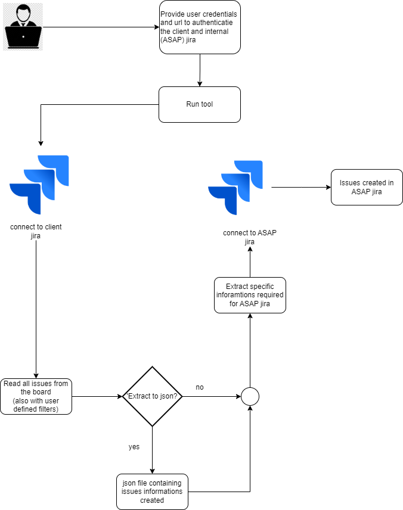

Jira Connector

The Jira Connector is a Python-based tool that provides functionalities to interact with the Jira API. It allows users to authenticate with Jira, fetch issues from Jira projects, and create new issues in Jira projects. It also provides the option to store fetched issues to a JSON file.
 

Prerequisites

Before using the Jira Connector, make sure you have the following:

Python 3.x installed on your system.

Jira instance with valid credentials (URL, username, and password) for the company Jira and client Jira.

jira and requests Python packages installed. If not, you can install them using pip:

pip install jira
pip install requests

Usage

Update the jira_config.ini file with the URLs, usernames, and passwords for the company Jira and client Jira. You can also update the project keys for which you want to fetch issues.

Import the required packages 
Use the various methods provided by the JiraConnectorApp class to interact with the Jira API. For example, you can fetch issues from the company Jira board using the fetch_company_issues() method.
You can also create a new issue in a Jira project using the create_issue() method.
Optionally, you can store the fetched issues to a JSON file using the store_issues_to_json() method.

Configuration
The jira_config.ini file is used for configuring the Jira instance URLs, usernames, and passwords. It has the following sections and keys:

company_jira: Configuration for the company Jira instance
url: URL of the company Jira instance
username: Username for authenticating with the company Jira instance
password: Password for authenticating with the company Jira instance
client_jira: Configuration for the client Jira instance
url: URL of the client Jira instance
username: Username for authenticating with the client Jira instance
password: Password for authenticating with the client Jira instance                                                                                                             Make sure to update the values of these keys with the appropriate URLs, usernames, and passwords for your Jira instances.

FutureScope
There is also a scope to add more features for this tool like filters from which sprint the information needed, may be more specific information like when a particular assignee inforamtion is only needed, etc.,
The tool could be customized to meet specific requirements of an organization, such as adding additional fields to the Jira issue object, or formatting rules.

Challenges
In order to use the tool, the user needs to be able to access the client's Jira from their own company network, and vice versa.

